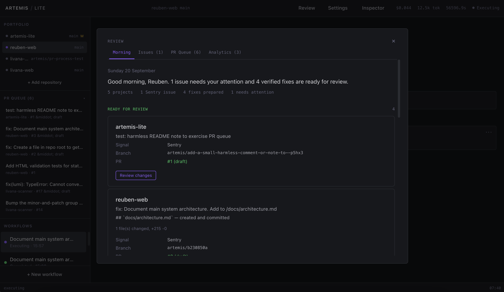

<div align="center">

```
 ╔══════════════════════════════════════════════════════════════════╗
 ║                                                                  ║
 ║      █████╗ ██████╗ ████████╗███████╗███╗   ███╗██╗███████╗      ║
 ║     ██╔══██╗██╔══██╗╚══██╔══╝██╔════╝████╗ ████║██║██╔════╝      ║
 ║     ███████║██████╔╝   ██║   █████╗  ██╔████╔██║██║███████╗      ║
 ║     ██╔══██║██╔══██╗   ██║   ██╔══╝  ██║╚██╔╝██║██║╚════██║      ║
 ║     ██║  ██║██║  ██║   ██║   ███████╗██║ ╚═╝ ██║██║███████║      ║
 ║     ╚═╝  ╚═╝╚═╝  ╚═╝   ╚═╝   ╚══════╝╚═╝     ╚═╝╚═╝╚══════╝      ║
 ║                                                                  ║
 ║                          ── LITE ──                              ║
 ║                                                                  ║
 ║    Deterministic Shell, Probabilistic Core                       ║
 ║                                                                  ║
 ║    [ SYSTEM ONLINE ] ──── Portfolio Operations Engine            ║
 ║                                                                  ║
 ╚══════════════════════════════════════════════════════════════════╝
```



<br />

**Workflow state machine** - **Context budgets** - **Durable recovery** - **Approval gates** - **Fault injection**

[](https://www.electronjs.org/)
[](https://docs.anthropic.com/)
[](https://react.dev/)
[](https://www.sqlite.org/)
[](https://vitest.dev/)

</div>

---

A persistent engineering operations system for supervising a portfolio of software repositories. Artemis Lite is a reconstruction of the original [Artemis](https://github.com/reuben-stone/artemis) around explicit workflow state, selective context, durable recovery and measurable execution. This is an ongoing personal engineering project; source is public for inspection and technical evaluation.

## Why it exists

The original Artemis proved that a desktop AI operations layer could coordinate meaningful engineering capabilities across a repository ecosystem. Building and using it exposed a harder problem: giving a model capabilities is relatively easy; controlling context, state, side effects, recovery, observability and tracing around those capabilities is not.

Artemis Lite tests a different architectural hypothesis:

> **Deterministic shell, probabilistic core.**

The application owns workflow lifecycle, persistence, approvals, retries, recovery, context budgets and tracing. The model owns only the decisions that genuinely require reasoning.

## Setup

### Requirements

- macOS (Apple Silicon or Intel)
- Node.js 20+
- Git

### Install

```bash
git clone https://github.com/reuben-stone/artemis-lite.git
cd artemis-lite
npm install
```

### Configure API Keys

Artemis Lite stores API keys encrypted at rest using your OS keychain (Electron safeStorage).

**Option A: Settings UI**

1. Run `npm run dev` to start the app
2. Click **Settings** in the top bar
3. Enter your API keys and click Save

**Option B: Environment file**

Create a `.env` file in the project root (already gitignored):

```
ANTHROPIC_API_KEY=sk-ant-...
GITHUB_TOKEN=ghp_...
```

Environment variables take precedence over stored keys.

### API Keys

| Key | Required | Purpose | Where to get it |
|-----|----------|---------|----------------|
| Anthropic API Key | Yes | Model calls (planning, verification) | [console.anthropic.com](https://console.anthropic.com) |
| GitHub Token | Optional | Read issues, PRs, checks; create PRs | [github.com/settings/personal-access-tokens](https://github.com/settings/personal-access-tokens) - needs Issues (read), Pull Requests (read/write), Checks (read) |

### Run

```bash
npm run dev
```

**Note:** `better-sqlite3` is a native module. After running tests (which rebuild for system Node), run this before starting the app:

```bash
npx electron-builder install-app-deps
```

## Architecture

```
Electron Client (React)
    |
typed IPC (Zod-validated, sandboxed)
    |
Workflow Orchestrator
  |-- Explicit state machine + recovery
  |-- Context Builder (budgeted, per-step)
  |-- Tool Registry (14 tools, read/write modes)
  |-- Model Provider (Anthropic adapter)
  |-- Scheduler (daily cron, Morning Review)
  |-- Approval gates
    |
SQLite persistence (WAL)
  workflows / steps / traces / approvals
  idempotency / usage / context packets / results
    |
Encrypted secrets (OS keychain via safeStorage)
```

### Tools

**Read:** `list_workspace_files`, `read_file`, `search_repository`, `run_command` (test/typecheck/lint/build), `git_diff`, `get_issues`, `get_issue_detail`, `get_pull_requests`, `get_pr_detail`

**Write (approval-gated):** `write_file`, `git_commit`, `create_branch`, `create_pull_request`, `create_work_item`

### Key Properties

- **Explicit workflow state** - transitions are application-owned and persisted
- **Structured Results** - deterministic summary built from validated tool outputs, not model prose
- **Selective context** - per-step budgeted evidence with observable selection/exclusion
- **Durable recovery** - resume from SQLite state after process interruption
- **Idempotency** - completed side effects are not repeated after recovery
- **Tool-specific reconciliation** - ambiguous outcomes checked against reality, not blindly retried
- **Observable usage** - model calls, tokens, cost and duration persisted per workflow
- **Fault injection** - Failure Lab with 8 injectable fault types for testing reliability
- **Multi-project portfolio** - register and switch between repositories
- **Morning Review** - aggregated workflow results across the portfolio
- **Encrypted secrets** - API keys stored via OS keychain, never exposed to renderer

## Commands

```
npm run dev          # Electron dev server
npm run build        # Production build
npm run typecheck    # TypeScript check (both configs)
npm test             # Vitest (303 tests across 18 files)
```

## Documentation

- [Architecture](docs/ARCHITECTURE.md) - system design and boundaries
- [Decisions](docs/DECISIONS.md) - architectural decision records
- [Roadmap](docs/ROADMAP.md) - implementation phases
- [North Star Architecture](docs/ARCHITECTURE-NORTH-STAR.md) - persistent portfolio operations destination
- [Context Feedback Roadmap](docs/CONTEXT-FEEDBACK-ROADMAP.md) - context evaluation direction

## Related

- [Original Artemis](https://github.com/reuben-stone/artemis) - the full multi-agent operations system
- [Engineering Case Study](https://www.reubenstone.co.uk/work/artemis) - portfolio case study covering both systems

## Licence

No open-source licence is currently granted. Unless otherwise stated, all rights are reserved.

## Author

Reuben Alexander Stone
